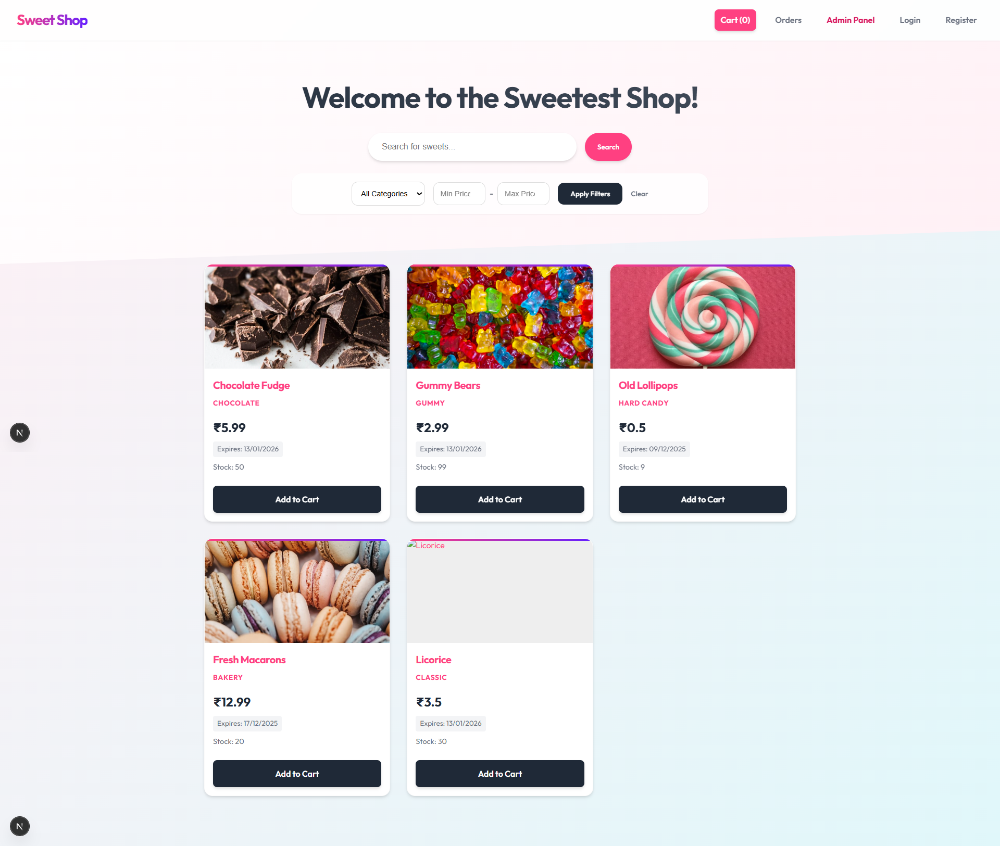
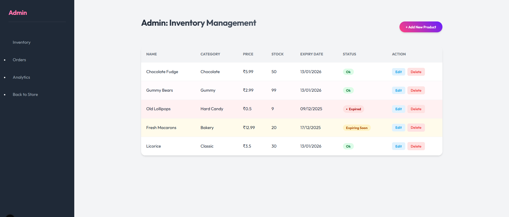
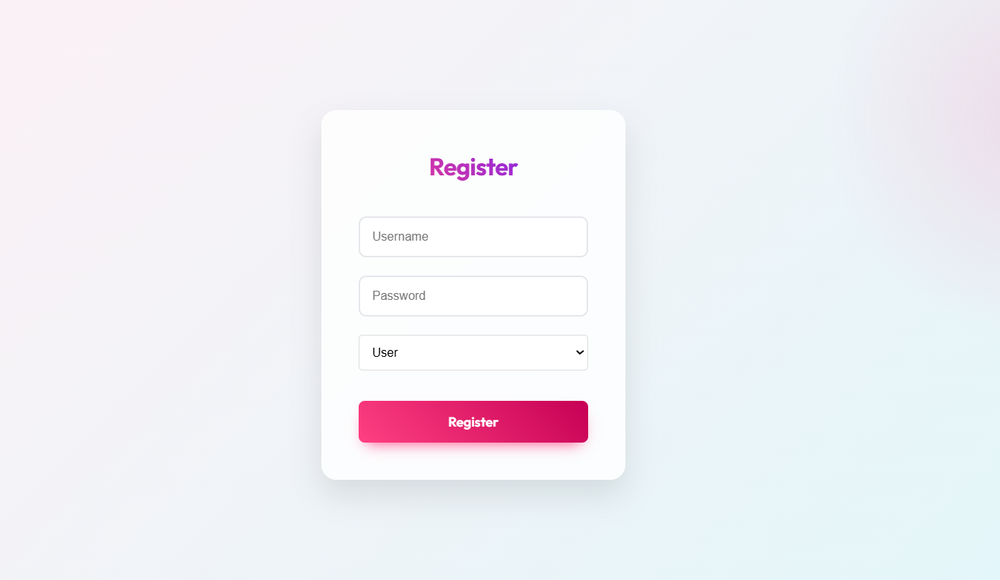
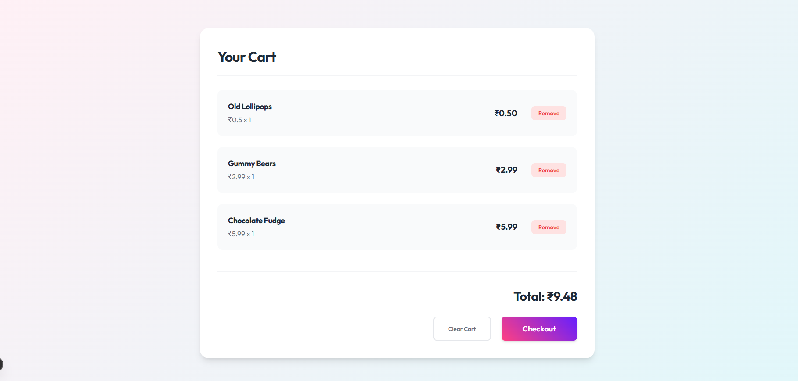
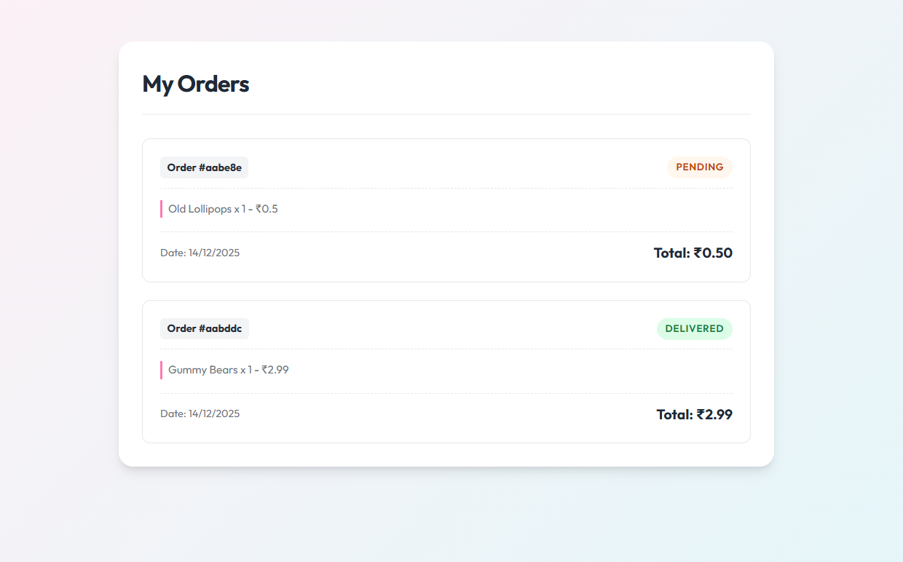
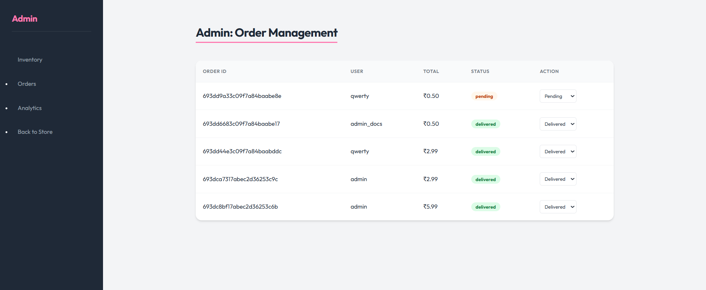
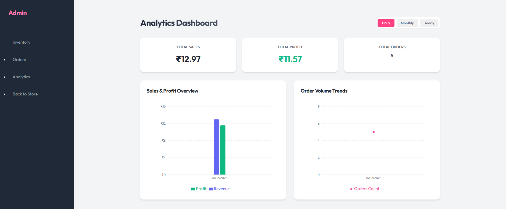
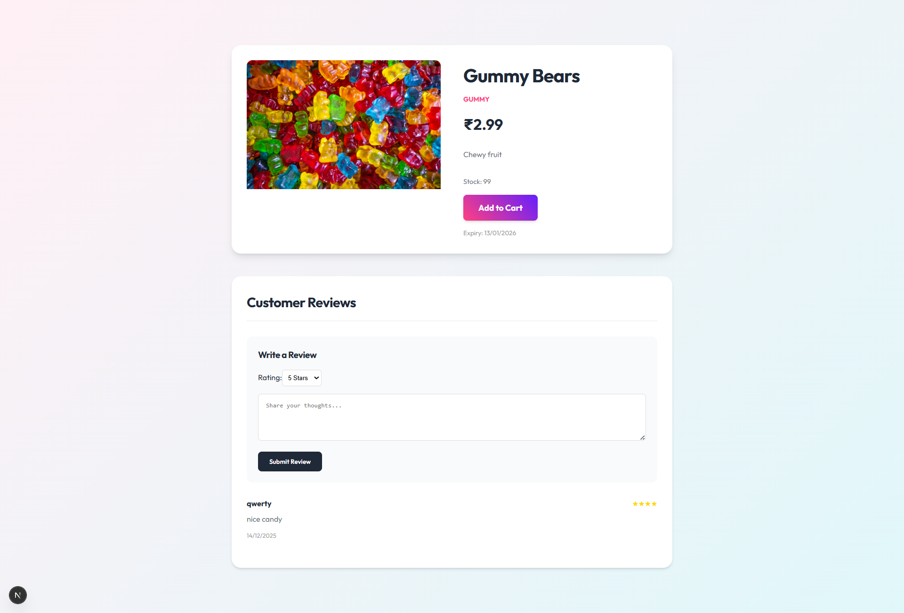

# 🍬 Sweet Shop Management System

A full-stack e-commerce application for managing and selling sweets, featuring a modern, responsive UI, dynamic search, cart functionality, and a comprehensive admin dashboard with analytics.


## ✨ Features

### 🛍️ User Features
*   **Product Catalog**: Browse a variety of sweets with details (Image, Price, Reviews).
*   **Advanced Search & Filter**: Filter products by Category, Price Range, and Name.
*   **Shopping Cart**: Add items, view summary, and checkout.
*   **Order History**: creating orders and viewing past purchases.
*   **Reviews**: Rate and review products.

### 🛡️ Admin Features
*   **Inventory Management**: Add, Edit, and Delete products.
*   **Order Management**: View all orders and update statuses.
*   **Analytics Dashboard**: Visual charts for Sales & Profits (Daily/Monthly/Yearly) using `recharts`.
*   **Secure Access**: Role-based authentication (Admin/User).

## 🛠️ Technology Stack
*   **Frontend**: Next.js (React), CSS Modules (Glassmorphism design).
*   **Backend**: Node.js, Express.js.
*   **Database**: MongoDB (with Mongoose).
*   **Authentication**: JWT (JSON Web Tokens).

## 🚀 Setup Instructions

### Prerequisites
*   Node.js (v14+)
*   MongoDB (Running locally or via Docker)

### 1. Database Setup
Ensure your MongoDB instance is running at `mongodb://127.0.0.1:27017/sweetshop` or update the `.env` file.

### 2. Backend Setup
```bash
cd backend
npm install
# Seed the database with initial products
node seed.js
# Start the server
npm start
```
Server runs on `http://localhost:5001`.

### 3. Frontend Setup
```bash
cd frontend
npm install
# Start the development server
npm run dev
```
Application runs on `http://localhost:3000`.

## 📸 Usage

1.  **Register/Login**: Create an account.
2.  **Shop**: Use the filters to find sweets and add them to your cart.
3.  **Checkout**: Place an order.
4.  **Admin Panel**: Login as an admin (Role: `admin`) to access the `Admin Panel` link in the nav bar.
    *   **Inventory**: Manage products through the "Add/Edit" forms.
    *   **Analytics**: View sales trends.

## 🤖 My AI Usage
This project was built with the assistance of **Antigravity**, a Google DeepMind AI agent.

*   **Code Generation**: usage of `replace_file_content` and `write_to_file` to generate the entire backend API, database models, and frontend components.
*   **Debugging**: The agent identified and fixed issues like "sweets.map is not a function" (API error handling) and "Inventory undefined" errors.
*   **Design**: The user interface features a custom "Glassmorphism" style implemented by the agent via CSS Modules.
*   **Feature Implementation**: Complex features like the Analytics Dashboard (charts) and Advanced Filtering were planned and executed by the AI.

---
Screenshot of the application: 















<video controls src="video.webp" title="Title" controls width="600"></video>