# Sweet Shop Management System

A full-stack e-commerce web application designed for browsing, purchasing, and managing sweet products. This project features a responsive storefront for customers and a comprehensive admin panel for inventory and sales management.

## Tech Stack

*   **Frontend**: Next.js (React framework), CSS Modules for styling.
*   **Backend**: Node.js, Express.js.
*   **Database**: MongoDB (Mongoose ODM).
*   **Authentication**: JSON Web Tokens (JWT).

## Key Features

### For Customers
*   **Product Browsing**: Search and filter sweets by category, price range, and name.
*   **Shopping Cart**: Add items, adjust quantities, and checkout.
*   **User Profile**: Manage personal details (Address, Mobile, etc.) and view order history.
*   **Live Notifications**: Receive real-time alerts when your order status changes (e.g., Shipped, Delivered).

### For Admins
*   **Dashboard Analytics**: Visualize sales trends, profit by category, and daily product volume.
*   **Inventory Management**: Create, update, and delete products (including image support).
*   **Order Management**: View detailed customer orders and update shipping status.
*   **Secure Access**: Role-based routing ensures only admins can access sensitive panels.

## Getting Started

Follow these steps to run the project locally.

### Prerequisites
*   Node.js (v16 or higher recommended)
*   MongoDB installed locally or a MongoDB Atlas connection string.

### 1. Backend Setup

Navigate to the backend directory and install dependencies:

```bash
cd backend
npm install
```

Create a `.env` file in the `backend` folder with the following variables:

```env
PORT=5000
MONGODB_URI=mongodb://localhost:27017/sweetshop
JWT_SECRET=your_super_secret_key_here
```

Start the backend server:

```bash
npm start
```
*The server should run on http://localhost:5000 (or the port you specified).*

### 2. Frontend Setup

Open a new terminal, navigate to the frontend directory, and install dependencies:

```bash
cd frontend
npm install
```

Start the development server:

```bash
npm run dev
```

Open [http://localhost:3000](http://localhost:3000) in your browser to see the application.

## Project Structure

*   **/backend**: Express API, Database models, and routes.
*   **/frontend**: Next.js application, components, and pages.

## License

This project is open-source and available under the MIT License.

Screenshot of website :
1. For User

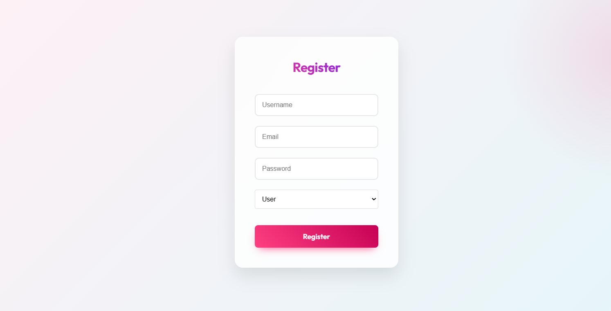
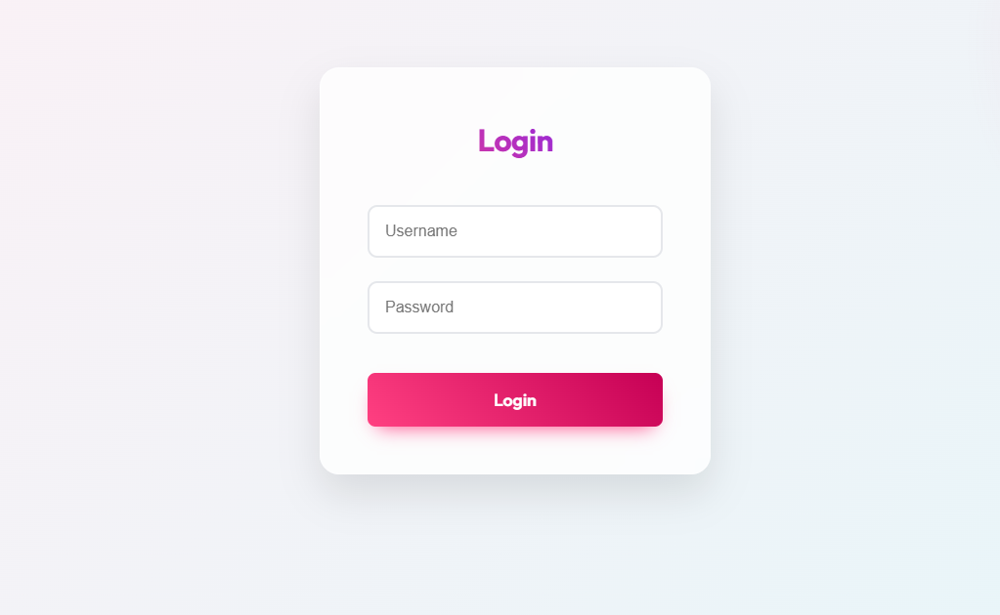
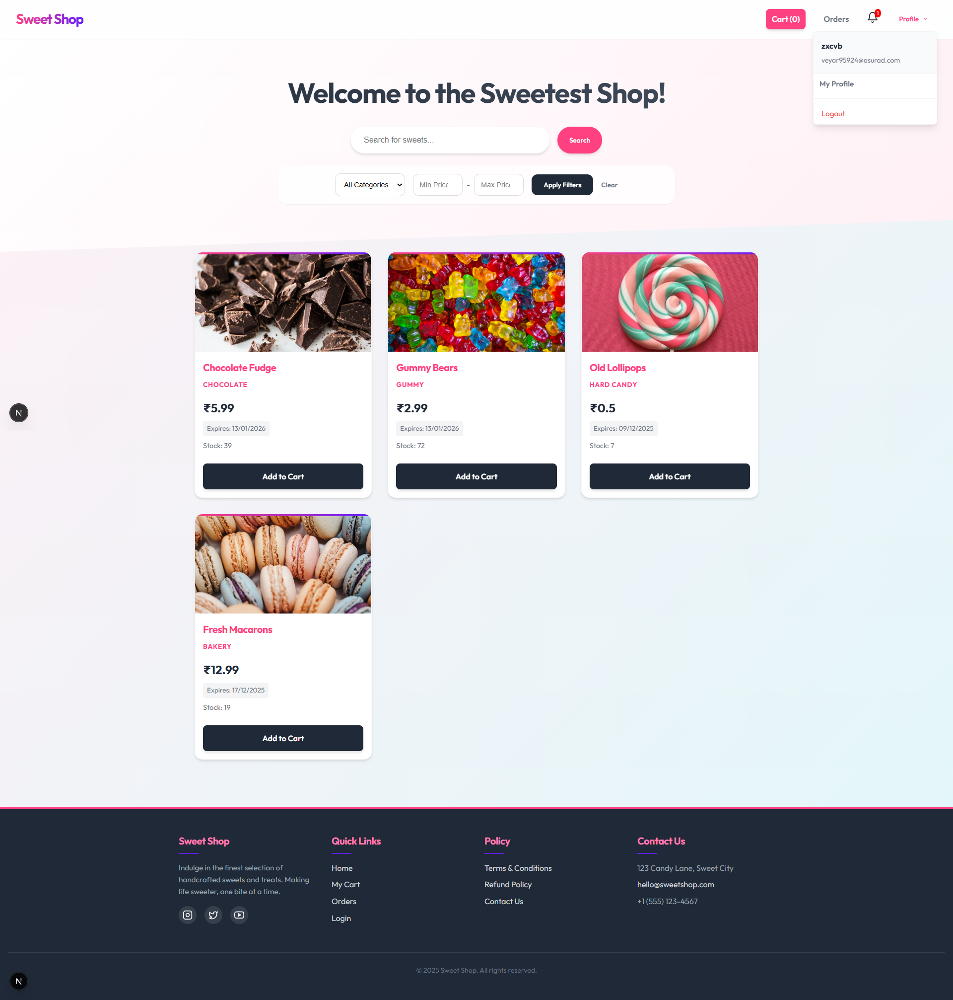
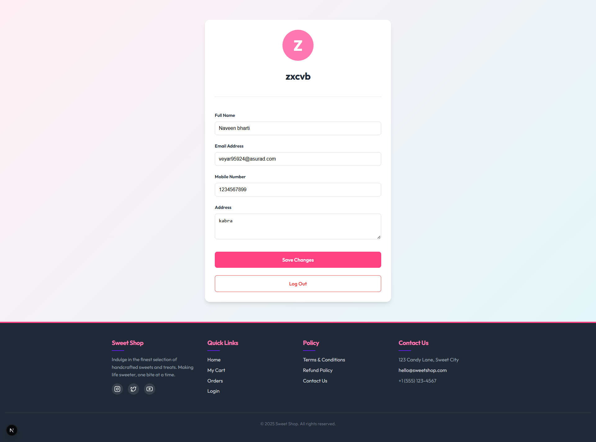
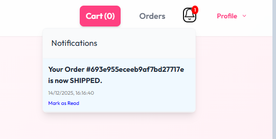
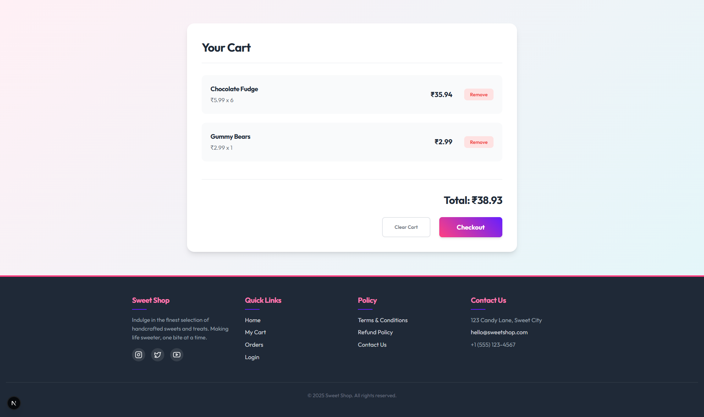
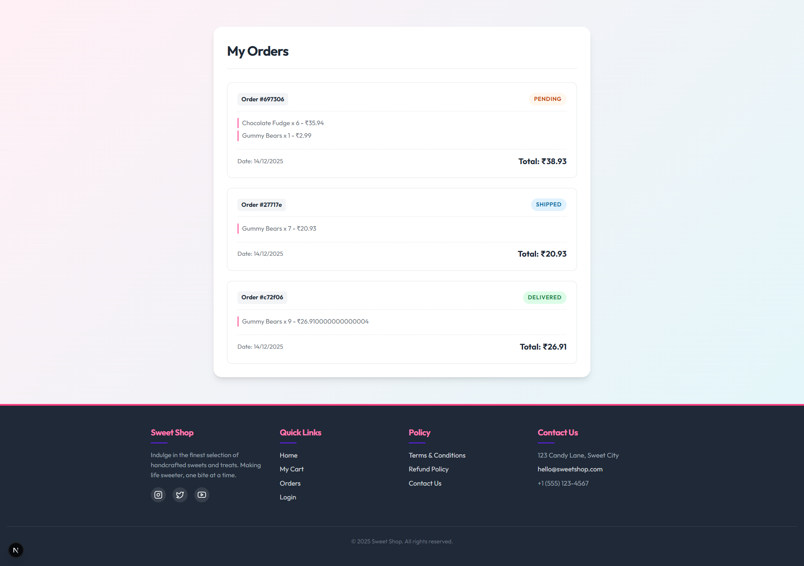

2. For Admin 

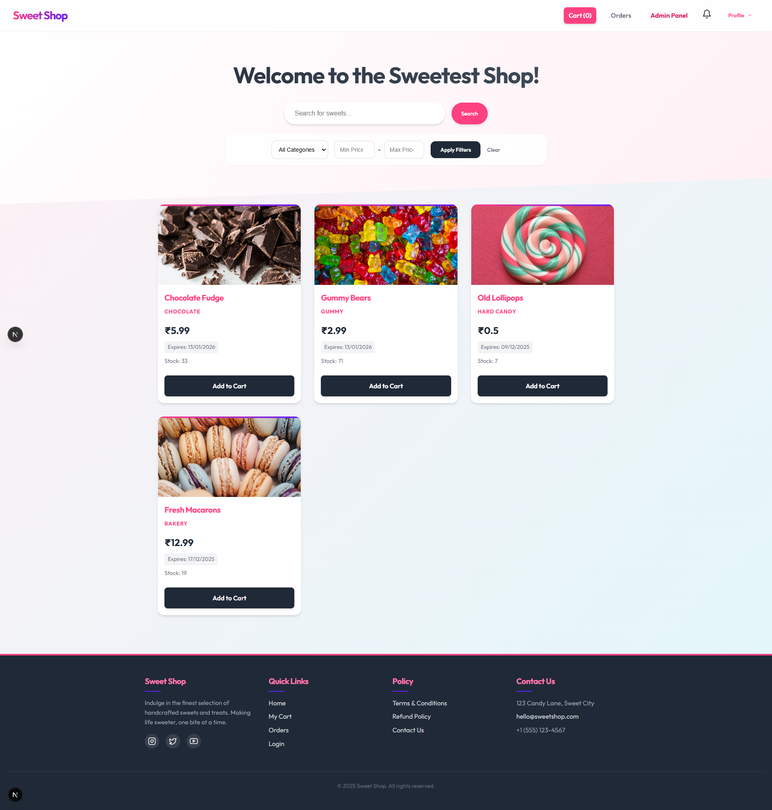
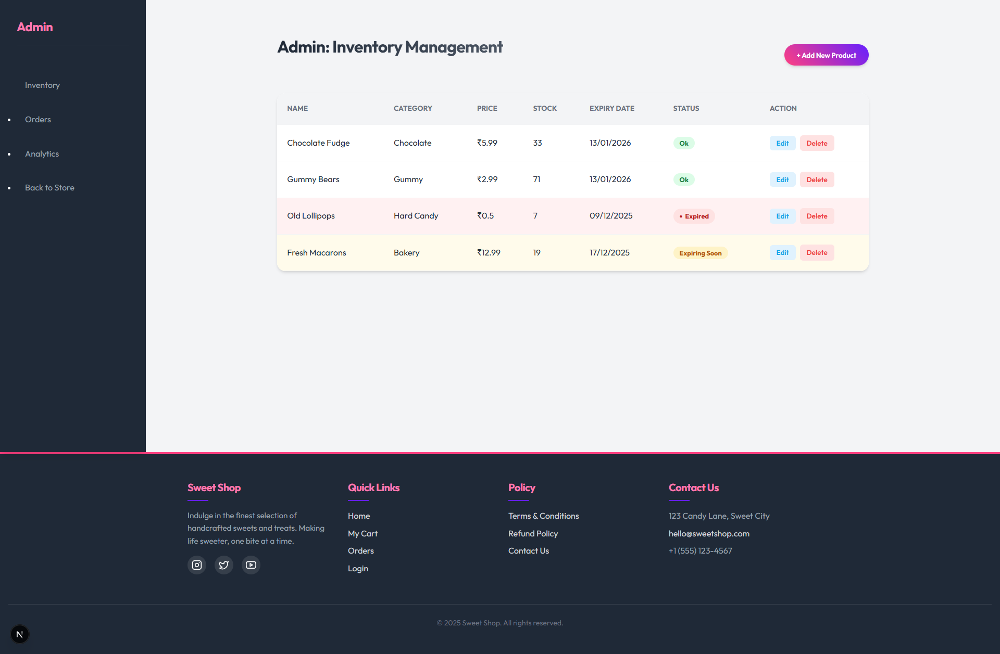


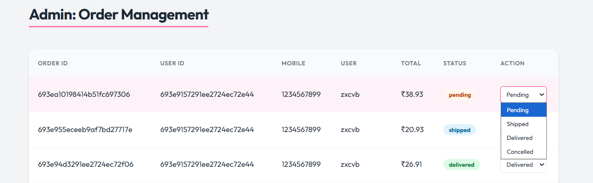
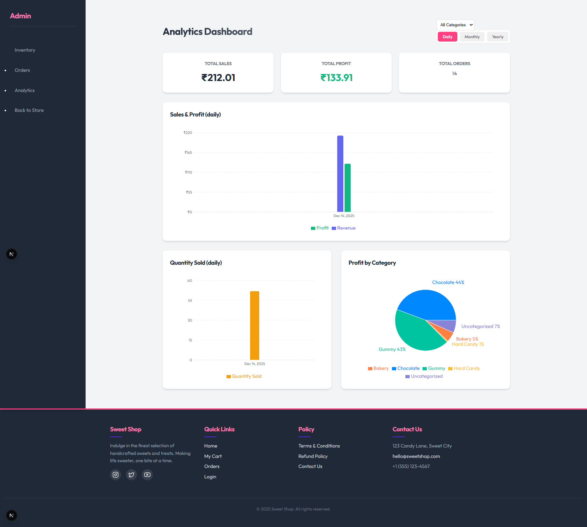

## Video Demo

### Watch the Application Walkthrough

[**Click here to watch the demo video**](https://drive.google.com/file/d/1AdTG6auLzUCqN0cDwZQ-1M0QPpq7MKoq/view?usp=drivesdk)

*(Click the link above to watch the video demo)*


